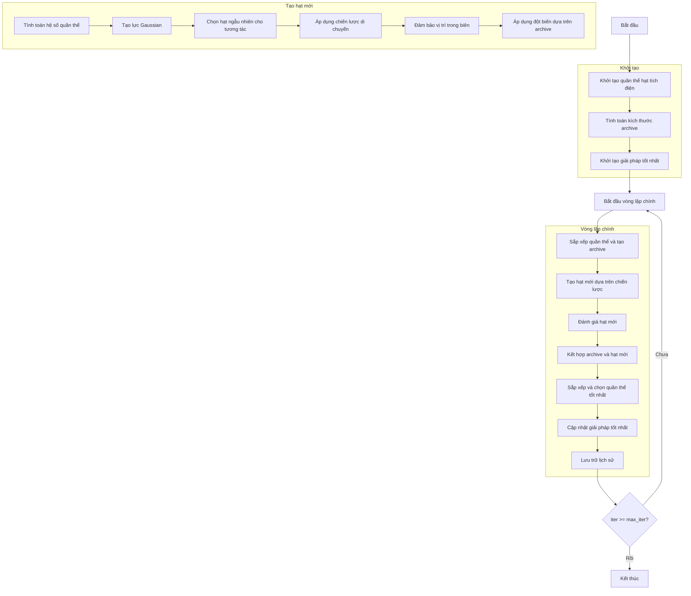

# Sơ đồ thuật toán Electromagnetic Charged Particles Optimizer



### Giải thích chi tiết các bước:

1. **Khởi tạo quần thể hạt tích điện**:
   - Tạo ngẫu nhiên các vị trí ban đầu cho hạt tích điện
   - Mỗi hạt đại diện cho một giải pháp trong không gian tìm kiếm

2. **Tính toán kích thước archive**:
   - Tính toán kích thước archive dựa trên tỷ lệ archive
   ```python
   archive_size = int(search_agents_no / self.archive_ratio)
   ```

3. **Khởi tạo giải pháp tốt nhất**:
   - Sắp xếp quần thể và chọn giải pháp tốt nhất ban đầu

4. **Vòng lặp chính** (max_iter lần):
   - **Sắp xếp quần thể và tạo archive**:
     * Sắp xếp quần thể theo độ thích nghi
     * Tạo archive từ các giải pháp tốt nhất
     ```python
     sorted_population, _ = self._sort_population(population)
     archive = sorted_population[:archive_size]
     ```
   
   - **Tạo hạt mới dựa trên chiến lược**:
     * **Tính toán hệ số quần thể**: Dựa trên chiến lược được chọn
     * **Tạo lực Gaussian**: Lực ngẫu nhiên với mean=0.7, std=0.2
     * **Chọn hạt ngẫu nhiên cho tương tác**: Chọn npi hạt từ quần thể
     * **Áp dụng chiến lược di chuyển**: Một trong ba chiến lược
     * **Đảm bảo vị trí trong biên**: Giữ vị trí trong phạm vi [lb, ub]
     * **Áp dụng đột biến dựa trên archive**: Thay thế giá trị từ archive
   
   - **Đánh giá hạt mới**:
     * Tính toán giá trị hàm mục tiêu cho các hạt mới
   
   - **Kết hợp archive và hạt mới**:
     * Kết hợp archive và các hạt mới tạo thành quần thể kết hợp
   
   - **Sắp xếp và chọn quần thể tốt nhất**:
     * Sắp xếp quần thể kết hợp theo độ thích nghi
     * Chọn các giải pháp tốt nhất cho quần thể tiếp theo
     ```python
     sorted_combined, _ = self._sort_population(combined_population)
     population = sorted_combined[:search_agents_no]
     ```
   
   - **Cập nhật giải pháp tốt nhất**:
     * So sánh và cập nhật nếu tìm thấy giải pháp tốt hơn
   
   - **Lưu trữ lịch sử**:
     * Lưu lại giải pháp tốt nhất tại mỗi lần lặp

### Chi tiết các chiến lược di chuyển:

**Chiến lược 1: Tương tác theo cặp**
- Tạo các hạt mới từ tương tác theo cặp giữa các hạt
- Di chuyển hướng về giải pháp tốt nhất
- Thêm tương tác với các hạt khác
- Số lượng hạt mới: 2 * C(npi, 2)

**Chiến lược 2: Tương tác kết hợp**
- Tạo các hạt mới từ tương tác kết hợp của tất cả hạt
- Di chuyển hướng về giải pháp tốt nhất (không dùng lực)
- Thêm tương tác với tất cả hạt khác
- Số lượng hạt mới: npi

**Chiến lược 3: Phương pháp lai ghép**
- Kết hợp cả hai loại di chuyển từ chiến lược 1 và 2
- Tạo cả hạt với lực đầy đủ và không lực
- Số lượng hạt mới: 2 * C(npi, 2) + npi

5. **Kết thúc**:
   - Lưu trữ kết quả cuối cùng
   - Hiển thị lịch sử tối ưu hóa
   - Trả về giải pháp tốt nhất
