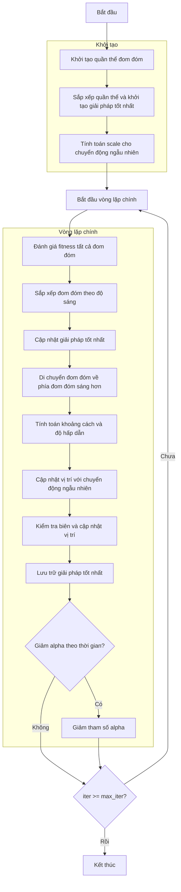

# Sơ đồ thuật toán Firefly Optimizer



### Giải thích chi tiết các bước:

1. **Khởi tạo quần thể đom đóm**: 
   - Tạo ngẫu nhiên các vị trí ban đầu trong không gian tìm kiếm
   - Mỗi vị trí X_i ∈ [lb, ub]^dim
   - Tính toán giá trị hàm mục tiêu objective_func(X_i)

2. **Sắp xếp quần thể và khởi tạo giải pháp tốt nhất**:
   - Sắp xếp quần thể dựa trên giá trị fitness (độ sáng)
   - Chọn giải pháp tốt nhất ban đầu

3. **Tính toán scale cho chuyển động ngẫu nhiên**:
   ```python
   scale = np.abs(self.ub - self.lb)
   ```

4. **Vòng lặp chính** (max_iter lần):
   - **Đánh giá fitness tất cả đom đóm**:
     * Tính toán lại giá trị hàm mục tiêu cho mỗi đom đóm

   - **Sắp xếp đom đóm theo độ sáng**:
     * Sắp xếp quần thể dựa trên fitness để xác định đom đóm sáng nhất

   - **Cập nhật giải pháp tốt nhất**:
     * So sánh và cập nhật nếu tìm thấy giải pháp tốt hơn

   - **Di chuyển đom đóm về phía đom đóm sáng hơn**:
     * Mỗi đom đóm di chuyển về phía các đom đóm sáng hơn nó
     ```python
     if self._is_better(population[j], population[i]):
         # Đom đóm i di chuyển về phía đom đóm j
     ```

   - **Tính toán khoảng cách và độ hấp dẫn**:
     ```python
     r = np.sqrt(np.sum((population[i].position - population[j].position)**2))
     beta = self._calculate_attractiveness(r)
     ```

   - **Cập nhật vị trí với chuyển động ngẫu nhiên**:
     ```python
     random_move = self.alpha * (np.random.random(self.dim) - 0.5) * scale
     new_position = (population[i].position * (1 - beta) + 
                    population[j].position * beta + 
                    random_move)
     ```

   - **Kiểm tra biên và cập nhật vị trí**:
     * Đảm bảo vị trí nằm trong biên [lb, ub]
     * Cập nhật vị trí đom đóm

   - **Lưu trữ giải pháp tốt nhất**:
     * Lưu lại giải pháp tốt nhất tại mỗi iteration

   - **Giảm tham số alpha** (nếu được kích hoạt):
     ```python
     if self.alpha_reduction:
         self.alpha = self._reduce_alpha(self.alpha, self.alpha_delta)
     ```

5. **Kết thúc**:
   - Lưu trữ kết quả cuối cùng
   - Hiển thị lịch sử tối ưu hóa
   - Trả về giải pháp tốt nhất và lịch sử
