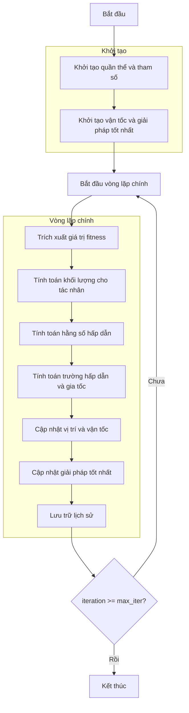

# Sơ đồ thuật toán Gravitational Search Optimizer



### Giải thích chi tiết các bước:

1. **Khởi tạo quần thể và tham số**:
   - Tạo ngẫu nhiên các tác nhân tìm kiếm ban đầu
   - Thiết lập các tham số thuật toán:
     * Kiểm tra elitist (elitist_check)
     * Tham số lũy thừa khoảng cách (r_power)
     * Hằng số hấp dẫn ban đầu (g0)
     * Tham số phân rã (alpha)

2. **Khởi tạo vận tốc và giải pháp tốt nhất**:
   - Khởi tạo ma trận vận tốc bằng 0
   - Chọn giải pháp tốt nhất ban đầu từ quần thể
   ```python
   self.velocities = np.zeros((search_agents_no, self.dim))
   best_solver = sorted_population[0].copy()
   ```

3. **Vòng lặp chính** (max_iter lần):
   - **Trích xuất giá trị fitness**:
     * Thu thập giá trị hàm mục tiêu của tất cả tác nhân
     ```python
     fitness_values = np.array([member.fitness for member in population])
     ```
   
   - **Tính toán khối lượng cho tác nhân**:
     * Tính khối lượng dựa trên độ thích nghi
     * Chuẩn hóa khối lượng để tổng bằng 1
     ```python
     masses = self._mass_calculation(fitness_values)
     ```
   
   - **Tính toán hằng số hấp dẫn**:
     * Giảm dần theo số lần lặp
     ```python
     g = self._gravitational_constant(iteration, max_iter)
     ```
   
   - **Tính toán trường hấp dẫn và gia tốc**:
     * Xác định kbest - số tác nhân tốt nhất để xem xét
     * Tính lực hấp dẫn giữa các tác nhân
     * Tính gia tốc dựa trên lực hấp dẫn
     ```python
     accelerations = self._gravitational_field(population, masses, iteration, max_iter, g)
     ```
   
   - **Cập nhật vị trí và vận tốc**:
     * Cập nhật vận tốc dựa trên gia tốc
     * Cập nhật vị trí dựa trên vận tốc
     * Đảm bảo vị trí nằm trong biên
     ```python
     population, self.velocities = self._update_positions(population, accelerations)
     ```
   
   - **Cập nhật giải pháp tốt nhất**:
     * So sánh và cập nhật nếu tìm thấy giải pháp tốt hơn
   
   - **Lưu trữ lịch sử**:
     * Lưu lại giải pháp tốt nhất tại mỗi lần lặp

4. **Kết thúc**:
   - Lưu trữ kết quả cuối cùng
   - Hiển thị lịch sử tối ưu hóa
   - Trả về giải pháp tốt nhất
