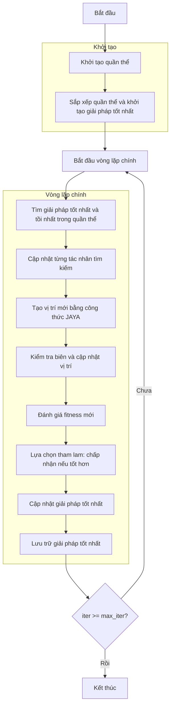

# Sơ đồ thuật toán JAYA Optimizer



### Giải thích chi tiết các bước:

1. **Khởi tạo quần thể**: 
   - Tạo ngẫu nhiên các vị trí ban đầu trong không gian tìm kiếm
   - Mỗi vị trí X_i ∈ [lb, ub]^dim
   - Tính toán giá trị hàm mục tiêu objective_func(X_i)

2. **Sắp xếp quần thể và khởi tạo giải pháp tốt nhất**:
   - Sắp xếp quần thể dựa trên giá trị fitness
   - Chọn giải pháp tốt nhất ban đầu

3. **Vòng lặp chính** (max_iter lần):
   - **Tìm giải pháp tốt nhất và tồi nhất trong quần thể**:
     * Xác định giải pháp tốt nhất (best_member) và tồi nhất (worst_member) trong quần thể hiện tại

   - **Cập nhật từng tác nhân tìm kiếm**:
     * Mỗi tác nhân cập nhật vị trí dựa trên công thức JAYA

   - **Tạo vị trí mới bằng công thức JAYA**:
     ```python
     new_position[j] = (
         population[i].position[j] + 
         rand1 * (best_member.position[j] - abs(population[i].position[j])) - 
         rand2 * (worst_member.position[j] - abs(population[i].position[j]))
     )
     ```
     * Công thức này giúp tác nhân tiến về phía giải pháp tốt nhất và tránh xa giải pháp tồi nhất

   - **Kiểm tra biên và cập nhật vị trí**:
     * Đảm bảo vị trí nằm trong biên [lb, ub]
     ```python
     new_position = np.clip(new_position, self.lb, self.ub)
     ```

   - **Đánh giá fitness mới**:
     * Tính toán giá trị hàm mục tiêu cho vị trí mới
     ```python
     new_fitness = self.objective_func(new_position)
     ```

   - **Lựa chọn tham lam: chấp nhận nếu tốt hơn**:
     * Chỉ chấp nhận vị trí mới nếu nó tốt hơn vị trí hiện tại
     ```python
     if self._is_better(Member(new_position, new_fitness), population[i]):
         population[i].position = new_position
         population[i].fitness = new_fitness
     ```

   - **Cập nhật giải pháp tốt nhất**:
     * So sánh và cập nhật nếu tìm thấy giải pháp tốt hơn

   - **Lưu trữ giải pháp tốt nhất**:
     * Lưu lại giải pháp tốt nhất tại mỗi iteration

4. **Kết thúc**:
   - Lưu trữ kết quả cuối cùng
   - Hiển thị lịch sử tối ưu hóa
   - Trả về giải pháp tốt nhất và lịch sử
