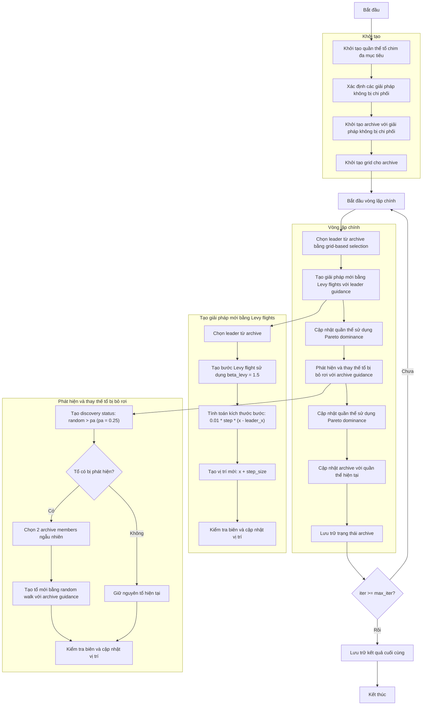

# Sơ đồ thuật toán Multi-Objective Cuckoo Search Optimizer



### Giải thích chi tiết các bước:

1. **Khởi tạo quần thể tổ chim đa mục tiêu**:
   - Tạo ngẫu nhiên các vị trí ban đầu trong không gian tìm kiếm
   - Mỗi tổ chim có vị trí và giá trị multi_fitness
   - Tính toán giá trị hàm mục tiêu đa mục tiêu objective_func(position)

2. **Xác định các giải pháp không bị chi phối**:
   - Phân tích quần thể để xác định các giải pháp không bị chi phối bởi giải pháp khác
   - Sử dụng quan hệ Pareto dominance

3. **Khởi tạo archive**:
   - Khởi tạo archive với các giải pháp không bị chi phối ban đầu
   - Archive lưu trữ tập các giải pháp Pareto optimal

4. **Khởi tạo grid**:
   - Tạo grid system để quản lý archive
   - Chia không gian mục tiêu thành các hypercubes
   ```python
   self.grid = self._create_hypercubes(costs)
   ```

5. **Vòng lặp chính** (max_iter lần):
   - **Chọn leader**:
     * Chọn leader từ archive sử dụng grid-based selection
     * Ưu tiên các grid ít đông đúc
     ```python
     leader = self._select_leader()
     ```

   - **Tạo giải pháp mới bằng Levy flights**:
     * Mỗi tổ chim tạo giải pháp mới sử dụng Levy flight với hướng dẫn từ leader
     * Sử dụng hệ số beta_levy = 1.5 cho Levy flight
     ```python
     step = self._levy_flight()  # Sử dụng beta_levy = 1.5
     step_size = 0.01 * step * (member.position - leader.position)
     new_position = member.position + step_size
     ```
     * Kiểm tra biên để đảm bảo vị trí nằm trong [lb, ub]

   - **Cập nhật quần thể sử dụng Pareto dominance**:
     * So sánh quần thể mới và quần thể cũ sử dụng quan hệ Pareto dominance
     * Giữ lại các giải pháp không bị chi phối
     ```python
     if self._dominates(new, current):
         updated_population.append(new)
     elif self._dominates(current, new):
         updated_population.append(current)
     else:
         # Chọn ngẫu nhiên nếu không có quan hệ dominance
         if np.random.random() < 0.5:
             updated_population.append(new)
         else:
             updated_population.append(current)
     ```

   - **Phát hiện và thay thế tổ bị bỏ rơi**:
     * Với xác suất pa = 0.25, các tổ chim bị phát hiện và bỏ rơi
     ```python
     discovery_status = np.random.random(n) > self.pa  # pa = 0.25
     ```
     * Tạo tổ mới bằng random walk với hướng dẫn từ archive:
     ```python
     if self.archive and len(self.archive) >= 2:
         idx1, idx2 = np.random.choice(len(self.archive), 2, replace=False)
         step_size = np.random.random() * (self.archive[idx1].position - self.archive[idx2].position)
     ```
     * Giữ nguyên các tổ không bị phát hiện

   - **Cập nhật quần thể sử dụng Pareto dominance**:
     * So sánh quần thể mới và quần thể cũ sử dụng quan hệ Pareto dominance
     * Giữ lại các giải pháp không bị chi phối

   - **Cập nhật archive**:
     * Thêm các giải pháp không bị chi phối mới vào archive
     * Duy trì kích thước archive và cập nhật grid
     ```python
     self._add_to_archive(population)
     ```

   - **Lưu trữ trạng thái archive**:
     * Lưu trạng thái archive hiện tại vào lịch sử

6. **Kết thúc**:
   - Lưu trữ kết quả cuối cùng
   - Trả về archive chứa tập các giải pháp Pareto optimal
