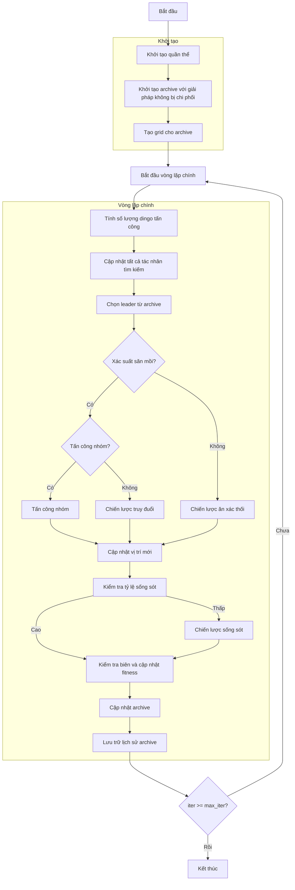

# Sơ đồ thuật toán Multi Objective Dingo Optimizer



### Giải thích chi tiết các bước:

1. **Khởi tạo quần thể**: 
   - Tạo ngẫu nhiên các vị trí ban đầu trong không gian tìm kiếm
   - Mỗi vị trí X_i ∈ [lb, ub]^dim
   - Tính toán giá trị hàm mục tiêu multi_fitness = objective_func(X_i)

2. **Khởi tạo archive với giải pháp không bị chi phối**:
   - Xác định các giải pháp không bị chi phối trong quần thể ban đầu
   - Thêm các giải pháp này vào archive bên ngoài

3. **Tạo grid cho archive**:
   - Tạo lưới hypercubes để quản lý archive
   - Gán chỉ số grid cho từng giải pháp trong archive

4. **Vòng lặp chính** (max_iter lần):
   - **Tính số lượng dingo tấn công**: 
     ```python
     na = self._calculate_attacking_dingoes(search_agents_no)
     ```
   
   - **Chọn leader từ archive**: Chọn leader từ archive sử dụng grid-based selection
   
   - **Xác định chiến lược săn mồi**:
     * Nếu random < p (0.5): thực hiện săn mồi
       - Nếu random < q (0.7): tấn công nhóm
         ```python
         sumatory = self._group_attack(population, na, current_idx)
         new_position = beta1 * sumatory - leader.position
         ```
       - Ngược lại: truy đuổi
         ```python
         new_position = leader.position + beta1 * exp(beta2) * (population[r1].position - current.position)
         ```
     * Ngược lại: ăn xác thối
       ```python
       new_position = (exp(beta2) * population[r1].position - ((-1)**binary_val) * current.position) / 2
       ```
   
   - **Kiểm tra tỷ lệ sống sót**:
     * Nếu survival_rate <= 0.3: thực hiện chiến lược sống sót
       ```python
       new_position = leader.position + (population[r1].position - ((-1)**binary_val) * population[r2].position) / 2
       ```
   
   - **Kiểm tra biên và cập nhật fitness**:
     * Đảm bảo vị trí nằm trong biên [lb, ub]
     * Tính toán lại giá trị hàm mục tiêu
   
   - **Cập nhật archive**: Thêm các giải pháp không bị chi phối mới vào archive
   
   - **Lưu trữ lịch sử archive**: Lưu trạng thái archive hiện tại

5. **Kết thúc**:
   - Lưu trữ kết quả cuối cùng
   - Trả về lịch sử archive và archive cuối cùng
