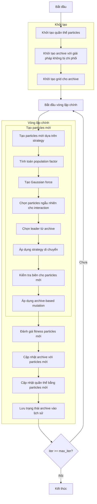

# Sơ đồ thuật toán Multi-Objective Electromagnetic Charged Particles Optimizer



### Giải thích chi tiết các bước:

1. **Khởi tạo quần thể particles**:
   - Tạo ngẫu nhiên các vị trí ban đầu trong không gian tìm kiếm
   - Mỗi particle có vị trí X_i ∈ [lb, ub]^dim

2. **Khởi tạo archive với giải pháp không bị chi phối**:
   - Xác định các giải pháp không bị chi phối trong quần thể ban đầu
   - Thêm các giải pháp này vào archive

3. **Khởi tạo grid cho archive**:
   - Tạo hypercubes để quản lý archive
   - Gán chỉ số grid cho từng giải pháp trong archive

4. **Tính toán population factor**:
   - Tính toán số lượng particles mới cần tạo dựa trên strategy
   ```python
   if self.strategy == 1:
       pop_factor = 2 * self._n_choose_2(self.npi)
   elif self.strategy == 2:
       pop_factor = self.npi
   else:  # strategy == 3
       pop_factor = 2 * self._n_choose_2(self.npi) + self.npi
   ```

5. **Tạo Gaussian force**:
   - Tạo lực ngẫu nhiên theo phân phối Gaussian
   ```python
   force = np.random.normal(0.7, 0.2)
   ```

6. **Chọn particles ngẫu nhiên cho interaction**:
   - Chọn ngẫu nhiên NPI particles từ quần thể
   ```python
   selected_indices = np.random.choice(len(population), self.npi, replace=False)
   selected_particles = [population[i] for i in selected_indices]
   ```

7. **Chọn leader từ archive**:
   - Sử dụng grid-based selection để chọn leader từ archive
   - Nếu archive rỗng, chọn particle tốt nhất từ selected particles
   ```python
   leader = self._select_leader()
   if leader is None:
       leader = self._get_best_from_population(selected_particles)
   ```

8. **Áp dụng strategy di chuyển**:
   - **Strategy 1**: Pairwise interactions giữa các particles
   - **Strategy 2**: Combined interactions từ tất cả particles
   - **Strategy 3**: Hybrid approach với hai loại di chuyển

9. **Kiểm tra biên cho particles mới**:
   - Đảm bảo vị trí particles nằm trong biên [lb, ub]
   ```python
   for particle in new_particles:
       particle.position = np.clip(particle.position, self.lb, self.ub)
   ```

10. **Áp dụng archive-based mutation**:
    - Với xác suất 20%, thay thế chiều bằng giá trị từ archive member ngẫu nhiên
    ```python
    if np.random.random() < 0.2:
        archive_member = np.random.choice(self.archive)
        particle.position[j] = archive_member.position[j]
    ```

11. **Đánh giá fitness particles mới**:
    - Tính toán giá trị fitness đa mục tiêu cho particles mới
    ```python
    for particle in new_particles:
        particle.multi_fitness = self.objective_func(particle.position)
    ```

12. **Cập nhật archive với particles mới**:
    - Thêm các giải pháp không bị chi phối mới vào archive
    - Loại bỏ các giải pháp bị chi phối
    ```python
    self._add_to_archive(new_particles)
    ```

13. **Cập nhật quần thể bằng particles mới**:
    - Thay thế các particles bị chi phối bằng particles mới
    ```python
    self._update_population(population, new_particles)
    ```

14. **Lưu trạng thái archive vào lịch sử**:
    - Lưu trữ bản sao của archive tại mỗi iteration
    ```python
    history_archive.append([member.copy() for member in self.archive])
    ```

15. **Kết thúc**:
    - Trả về lịch sử archive và archive cuối cùng
    - Hiển thị kết quả tối ưu hóa

### Các Strategy di chuyển:

#### Strategy 1: Pairwise Interactions
```python
for i in range(self.npi):
    for j in range(self.npi):
        if i == j:
            continue
        new_position += force * (leader.position - selected_particles[i].position)
        if j < i:
            new_position += force * (selected_particles[j].position - selected_particles[i].position)
        else:
            new_position -= force * (selected_particles[j].position - selected_particles[i].position)
```

#### Strategy 2: Combined Interactions
```python
for i in range(self.npi):
    new_position += 0 * force * (leader.position - selected_particles[i].position)
    for j in range(self.npi):
        if j < i:
            new_position += force * (selected_particles[j].position - selected_particles[i].position)
        elif j > i:
            new_position -= force * (selected_particles[j].position - selected_particles[i].position)
```

#### Strategy 3: Hybrid Approach
```python
# Type 1 movement (similar to strategy 1)
s1_position += force * (leader.position - selected_particles[i].position)
# Type 2 movement (full force towards leader)
s2_position += 1 * force * (leader.position - selected_particles[i].position)
```

### Tham số quan trọng:
- **strategy**: Chiến lược di chuyển (1, 2, hoặc 3)
- **npi**: Số particles cho interaction
- **force**: Lực electromagnetic (Gaussian distribution)
- **archive_size**: Kích thước archive
