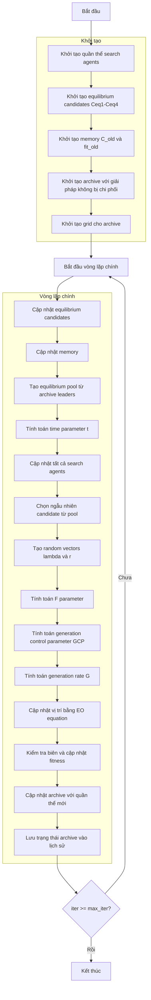

# Sơ đồ thuật toán Multi-Objective Equilibrium Optimizer



### Giải thích chi tiết các bước:

1. **Khởi tạo quần thể search agents**:
   - Tạo ngẫu nhiên các vị trí ban đầu trong không gian tìm kiếm
   - Mỗi agent có vị trí X_i ∈ [lb, ub]^dim

2. **Khởi tạo equilibrium candidates Ceq1-Ceq4**:
   - Khởi tạo 4 equilibrium candidates với giá trị ban đầu
   ```python
   Ceq1 = EquilibriumMultiMember(np.zeros(self.dim), np.full(self.n_objectives, np.inf if not self.maximize else -np.inf))
   Ceq2 = EquilibriumMultiMember(np.zeros(self.dim), np.full(self.n_objectives, np.inf if not self.maximize else -np.inf))
   Ceq3 = EquilibriumMultiMember(np.zeros(self.dim), np.full(self.n_objectives, np.inf if not self.maximize else -np.inf))
   Ceq4 = EquilibriumMultiMember(np.zeros(self.dim), np.full(self.n_objectives, np.inf if not self.maximize else -np.inf))
   ```

3. **Khởi tạo memory C_old và fit_old**:
   - Khởi tạo memory cho previous population và fitness
   ```python
   C_old = [member.copy() for member in population]
   fit_old = np.array([member.multi_fitness for member in population])
   ```

4. **Khởi tạo archive với giải pháp không bị chi phối**:
   - Xác định các giải pháp không bị chi phối trong quần thể ban đầu
   - Thêm các giải pháp này vào archive

5. **Khởi tạo grid cho archive**:
   - Tạo hypercubes để quản lý archive
   - Gán chỉ số grid cho từng giải pháp trong archive

6. **Cập nhật equilibrium candidates**:
   - Cập nhật 4 candidates tốt nhất dựa trên Pareto dominance
   ```python
   if self._dominates(member, Ceq1):
       Ceq4 = Ceq3.copy()
       Ceq3 = Ceq2.copy()
       Ceq2 = Ceq1.copy()
       Ceq1 = member.copy()
   ```

7. **Cập nhật memory**:
   - So sánh current population với memory
   - Giữ lại solutions tốt hơn từ memory
   ```python
   if self._dominates(old_member, population[i]):
       population[i].multi_fitness = fit_old[i]
       population[i].position = C_old[i].position.copy()
   ```

8. **Tạo equilibrium pool từ archive leaders**:
   - Chọn 4 leaders đa dạng từ archive
   - Tạo candidate trung bình (Ceq_ave)
   ```python
   leaders = self._select_multiple_leaders(4)
   Ceq_ave_pos = (Ceq1_arch.position + Ceq2_arch.position + Ceq3_arch.position + Ceq4_arch.position) / 4
   Ceq_pool = [Ceq1_arch, Ceq2_arch, Ceq3_arch, Ceq4_arch, Ceq_ave]
   ```

9. **Tính toán time parameter t**:
   - Tính toán tham số thời gian giảm dần theo iteration
   ```python
   t = (1 - iter / max_iter) ** (self.a2 * iter / max_iter)
   ```

10. **Chọn ngẫu nhiên candidate từ pool**:
    - Chọn ngẫu nhiên một candidate từ equilibrium pool
    ```python
    Ceq = np.random.choice(Ceq_pool)
    ```

11. **Tạo random vectors lambda và r**:
    - Tạo vector ngẫu nhiên lambda và r
    ```python
    lambda_vec = np.random.random(self.dim)
    r = np.random.random(self.dim)
    ```

12. **Tính toán F parameter**:
    - Tính toán tham số F cho phương trình EO
    ```python
    F = self.a1 * np.sign(r - 0.5) * (np.exp(-lambda_vec * t) - 1)
    ```

13. **Tính toán generation control parameter GCP**:
    - Tính toán tham số điều khiển generation
    ```python
    GCP = 0.5 * r1 * np.ones(self.dim) * (r2 >= self.GP)
    ```

14. **Tính toán generation rate G**:
    - Tính toán tốc độ generation
    ```python
    G0 = GCP * (Ceq.position - lambda_vec * population[i].position)
    G = G0 * F
    ```

15. **Cập nhật vị trí bằng EO equation**:
    - Cập nhật vị trí sử dụng phương trình EO chính
    ```python
    new_position = Ceq.position + \
                  (population[i].position - Ceq.position) * F + \
                  (G / (lambda_vec * 1.0)) * (1 - F)
    ```

16. **Kiểm tra biên và cập nhật fitness**:
    - Đảm bảo vị trí nằm trong biên [lb, ub]
    - Tính toán giá trị fitness đa mục tiêu mới
    ```python
    new_position = np.clip(new_position, self.lb, self.ub)
    population[i].position = new_position
    population[i].multi_fitness = self.objective_func(new_position)
    ```

17. **Cập nhật archive với quần thể mới**:
    - Thêm các giải pháp không bị chi phối mới vào archive
    - Loại bỏ các giải pháp bị chi phối
    ```python
    self._add_to_archive(population)
    ```

18. **Lưu trạng thái archive vào lịch sử**:
    - Lưu trữ bản sao của archive tại mỗi iteration
    ```python
    history_archive.append([member.copy() for member in self.archive])
    ```

19. **Kết thúc**:
    - Trả về lịch sử archive và archive cuối cùng
    - Hiển thị kết quả tối ưu hóa

### Phương trình EO chính:
```python
new_position = Ceq.position + \
              (current.position - Ceq.position) * F + \
              (G / (lambda_vec * 1.0)) * (1 - F)
```

### Tham số quan trọng:
- **a1**: Exploration parameter
- **a2**: Exploitation parameter  
- **GP**: Generation probability
- **t**: Time parameter (giảm dần theo iteration)
- **F**: Exploration/exploitation balance parameter
- **G**: Generation rate parameter

### Đặc điểm của Multi-Objective EO:
- Mô phỏng cân bằng động lực học trong hệ thống vật lý
- Sử dụng equilibrium pool với 4 candidates tốt nhất + 1 candidate trung bình
- Memory mechanism để lưu trữ solutions tốt
- Archive management cho multi-objective optimization
- Kết hợp exploration và exploitation thông qua tham số F
- Generation rate G để tạo ra các solutions mới
