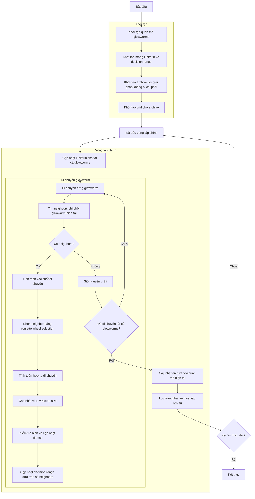

# Sơ đồ thuật toán Multi-Objective Glowworm Swarm Optimizer



### Giải thích chi tiết các bước:

1. **Khởi tạo quần thể glowworms**:
   - Tạo ngẫu nhiên các vị trí ban đầu trong không gian tìm kiếm
   - Mỗi glowworm có vị trí X_i ∈ [lb, ub]^dim
   - Khởi tạo với luciferin ban đầu và decision range
   ```python
   population = []
   for _ in range(search_agents_no):
       position = np.random.uniform(self.lb, self.ub, self.dim)
       fitness = self.objective_func(position)
       population.append(GlowwormMultiMember(position, fitness, self.L0, self.r0))
   ```

2. **Khởi tạo mảng luciferin và decision range**:
   - Khởi tạo mảng luciferin với giá trị ban đầu L0
   - Khởi tạo mảng decision range với giá trị ban đầu r0
   ```python
   self.luciferin = np.array([self.L0] * search_agents_no)
   self.decision_range = np.array([self.r0] * search_agents_no)
   ```

3. **Khởi tạo archive với giải pháp không bị chi phối**:
   - Xác định các giải pháp không bị chi phối trong quần thể ban đầu
   - Thêm các giải pháp này vào archive

4. **Khởi tạo grid cho archive**:
   - Tạo hypercubes để quản lý archive
   - Gán chỉ số grid cho từng giải pháp trong archive

5. **Cập nhật luciferin cho tất cả glowworms**:
   - Cập nhật giá trị luciferin dựa trên fitness đa mục tiêu
   ```python
   for i, member in enumerate(population):
       self.luciferin[i] = (1 - self.rho) * self.luciferin[i] + self.gamma * self._calculate_luciferin(member)
   ```

6. **Tìm neighbors chi phối glowworm hiện tại**:
   - Tìm các neighbors trong decision range mà chi phối glowworm hiện tại
   - Chỉ xem xét neighbors có luciferin cao hơn
   ```python
   neighbors = self._get_neighbors(i, population)
   ```

7. **Tính toán xác suất di chuyển**:
   - Xác suất di chuyển tỷ lệ với chênh lệch luciferin
   ```python
   probabilities = (neighbor_luciferin - current_luciferin) / np.sum(neighbor_luciferin - current_luciferin)
   ```

8. **Chọn neighbor bằng roulette wheel selection**:
   - Chọn một neighbor để di chuyển về phía nó
   ```python
   selected_neighbor_idx = self._roulette_wheel_selection(probabilities)
   ```

9. **Tính toán hướng di chuyển**:
   - Tính vector hướng từ glowworm hiện tại đến neighbor được chọn
   ```python
   direction = neighbor_pos - current_pos
   distance = self._euclidean_distance(current_pos, neighbor_pos)
   ```

10. **Cập nhật vị trí với step size**:
    - Di chuyển glowworm với step size s theo hướng đã tính
    ```python
    direction_normalized = direction / distance
    new_position = current_pos + self.s * direction_normalized
    ```

11. **Kiểm tra biên và cập nhật fitness**:
    - Đảm bảo vị trí nằm trong biên [lb, ub]
    - Tính toán giá trị fitness đa mục tiêu mới
    ```python
    new_position = np.clip(new_position, self.lb, self.ub)
    population[i].position = new_position
    population[i].multi_fitness = self.objective_func(new_position)
    ```

12. **Cập nhật decision range dựa trên số neighbors**:
    - Điều chỉnh decision range dựa trên số lượng neighbors
    ```python
    self.decision_range[i] = min(self.rs, max(0, self.decision_range[i] + self.beta * (self.nt - neighbor_count)))
    ```

13. **Cập nhật archive với quần thể hiện tại**:
    - Thêm các giải pháp không bị chi phối mới vào archive
    - Loại bỏ các giải pháp bị chi phối
    ```python
    self._add_to_archive(population)
    ```

14. **Lưu trạng thái archive vào lịch sử**:
    - Lưu trữ bản sao của archive tại mỗi iteration
    ```python
    history_archive.append([member.copy() for member in self.archive])
    ```

15. **Kết thúc**:
    - Trả về lịch sử archive và archive cuối cùng
    - Hiển thị kết quả tối ưu hóa

### Tham số quan trọng:
- **L0**: Giá trị luciferin ban đầu
- **r0**: Decision range ban đầu
- **rho**: Hằng số phân rã luciferin
- **gamma**: Hằng số tăng cường luciferin
- **beta**: Hằng số cập nhật decision range
- **s**: Step size cho di chuyển
- **rs**: Maximum sensing range
- **nt**: Số neighbors mong muốn

### Đặc điểm của Multi-Objective GSO:
- Sử dụng Pareto dominance để xác định neighbors hợp lệ
- Luciferin được tính dựa trên fitness đa mục tiêu
- Decision range tự động điều chỉnh dựa trên mật độ neighbors
- Archive management để duy trì đa dạng giải pháp
