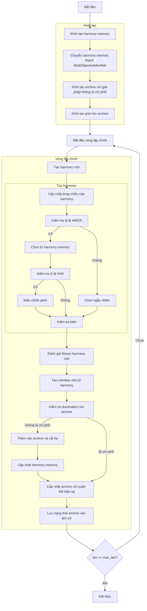

# Sơ đồ thuật toán Multi-Objective Harmony Search Optimizer



### Giải thích chi tiết các bước:

1. **Khởi tạo harmony memory**:
   - Khởi tạo harmony memory với kích thước HMS
   - Tạo các giải pháp ngẫu nhiên ban đầu
   ```python
   self.harmony_memory = np.zeros((self.hms, self.dim))
   for i in range(self.hms):
       position = np.random.uniform(self.lb, self.ub, self.dim)
       fitness = self.objective_func(position)
       self.harmony_memory[i] = position
       self.harmony_fitness.append(fitness)
   ```

2. **Chuyển harmony memory thành MultiObjectiveMember**:
   - Chuyển đổi các harmony thành đối tượng MultiObjectiveMember
   ```python
   population = []
   for i in range(self.hms):
       member = MultiObjectiveMember(self.harmony_memory[i].copy(), np.array(self.harmony_fitness[i]))
       population.append(member)
   ```

3. **Khởi tạo archive với giải pháp không bị chi phối**:
   - Xác định các giải pháp không bị chi phối trong harmony memory
   - Thêm các giải pháp này vào archive

4. **Khởi tạo grid cho archive**:
   - Tạo hypercubes để quản lý archive
   - Gán chỉ số grid cho từng giải pháp trong archive

5. **Tạo harmony mới**:
   - Tạo một harmony mới cho mỗi iteration

6. **Cập nhật từng chiều của harmony**:
   - Duyệt qua từng chiều của không gian tìm kiếm

7. **Kiểm tra tỷ lệ HMCR (Harmony Memory Considering Rate)**:
   - Nếu số ngẫu nhiên < HMCR, chọn từ harmony memory
   - Nếu không, chọn ngẫu nhiên
   ```python
   if np.random.random() < self.hmcr:
   ```

8. **Chọn từ harmony memory**:
   - Chọn ngẫu nhiên một harmony từ memory
   ```python
   harmony_idx = np.random.randint(0, self.hms)
   new_harmony[j] = self.harmony_memory[harmony_idx, j]
   ```

9. **Kiểm tra tỷ lệ PAR (Pitch Adjustment Rate)**:
   - Nếu số ngẫu nhiên < PAR, điều chỉnh pitch
   ```python
   if np.random.random() < self.par:
   ```

10. **Điều chỉnh pitch**:
    - Thêm nhiễu vào giá trị đã chọn
    ```python
    new_harmony[j] += self.bw * (2 * np.random.random() - 1)
    ```

11. **Chọn ngẫu nhiên**:
    - Chọn giá trị ngẫu nhiên trong biên cho phép
    ```python
    new_harmony[j] = np.random.uniform(self.lb[j], self.ub[j])
    ```

12. **Kiểm tra biên**:
    - Đảm bảo harmony nằm trong biên [lb, ub]
    ```python
    new_harmony = np.clip(new_harmony, self.lb, self.ub)
    ```

13. **Đánh giá fitness harmony mới**:
    - Tính toán giá trị fitness đa mục tiêu
    ```python
    new_fitness = self.objective_func(new_harmony)
    ```

14. **Tạo member mới từ harmony**:
    - Tạo đối tượng MultiObjectiveMember từ harmony mới
    ```python
    new_member = MultiObjectiveMember(new_harmony.copy(), np.array(new_fitness))
    ```

15. **Kiểm tra domination với archive**:
    - Kiểm tra xem harmony mới có bị chi phối bởi archive không
    - Nếu không bị chi phối, thêm vào archive

16. **Thêm vào archive và cắt tỉa**:
    - Thêm harmony mới vào archive
    - Cắt tỉa archive nếu vượt quá kích thước
    ```python
    self.archive.append(new_member.copy())
    self._trim_archive()
    ```

17. **Cập nhật harmony memory**:
    - Thay thế harmony tồi nhất trong memory bằng harmony mới
    ```python
    replace_idx = np.random.randint(0, self.hms)
    self.harmony_memory[replace_idx] = new_harmony.copy()
    self.harmony_fitness[replace_idx] = new_fitness
    population[replace_idx] = new_member
    ```

18. **Cập nhật archive với quần thể hiện tại**:
    - Thêm các giải pháp không bị chi phối từ quần thể hiện tại vào archive
    ```python
    self._add_to_archive(population)
    ```

19. **Lưu trạng thái archive vào lịch sử**:
    - Lưu trữ bản sao của archive tại mỗi iteration

20. **Kết thúc**:
    - Trả về lịch sử archive và archive cuối cùng
    - Hiển thị kết quả tối ưu hóa

### Tham số quan trọng:
- **HMS**: Kích thước harmony memory
- **HMCR**: Tỷ lệ xem xét harmony memory (0.0-1.0)
- **PAR**: Tỷ lệ điều chỉnh pitch (0.0-1.0)
- **BW**: Bandwidth cho điều chỉnh pitch
