# Sơ đồ thuật toán Multi Objective Moss Growth Optimizer

```mermaid
flowchart TD
    A["Bắt đầu"] --> B["Khởi tạo quần thể"]
    B --> C["Khởi tạo archive với giải pháp không bị chi phối"]
    C --> D["Tạo grid cho archive"]
    D --> E["Khởi tạo cơ chế cryptobiosis"]
    E --> F["Bắt đầu vòng lặp chính"]
    F --> G["Tính tỷ lệ tiến trình"]
    G --> H["Ghi nhận thế hệ đầu cho cryptobiosis"]
    H --> I["Xử lý từng tác nhân tìm kiếm"]
    I --> J["Chọn leader từ archive"]
    J --> K["Chọn vùng tính toán dựa trên đa số"]
    K --> L["Tính khoảng cách đến leader"]
    L --> M["Tính hướng gió trung bình"]
    M --> N["Tính tham số beta và gamma"]
    N --> O["Tính kích thước bước di chuyển"]
    O --> P{"Xác suất phân tán bào tử?"}
    P -- "Cao" --> Q["Tìm kiếm phân tán bào tử: position + step * D_wind"]
    P -- "Thấp" --> R["Tìm kiếm phân tán bào tử thay thế: position + step2 * D_wind"]
    Q --> S{"Xác suất lan truyền kép?"}
    R --> S
    S -- "Có" --> T{"Cập nhật chiều riêng lẻ?"}
    S -- "Không" --> U["Cập nhật tất cả chiều với hàm kích hoạt"]
    T -- "Có" --> V["Cập nhật chiều cụ thể: leader.position + step3 * D_wind[dim]"]
    T -- "Không" --> U
    V --> W["Kiểm tra biên và cập nhật fitness"]
    U --> W
    W --> X["Ghi nhận lịch sử cho cryptobiosis"]
    X --> Y{"Đủ số lượng ghi nhận hoặc lần lặp cuối?"}
    Y -- "Có" --> Z["Áp dụng cơ chế cryptobiosis"]
    Y -- "Không" --> AA["Tăng bộ đếm ghi nhận"]
    Z --> AB["Cập nhật archive"]
    AA --> AB
    AB --> AC["Lưu trữ lịch sử archive"]
    AC --> AD{"iter >= max_iter?"}
    AD -- "Chưa" --> F
    AD -- "Rồi" --> AE["Kết thúc"]
    
    subgraph Khởi tạo
    B
    C
    D
    E
    end
    
    subgraph Vòng lặp chính
    G
    H
    I
    J
    K
    L
    M
    N
    O
    P
    Q
    R
    S
    T
    U
    V
    W
    X
    Y
    Z
    AA
    AB
    AC
    end
```



### Giải thích chi tiết các bước:

1. **Khởi tạo quần thể**: 
   - Tạo ngẫu nhiên các vị trí ban đầu trong không gian tìm kiếm
   - Mỗi vị trí X_i ∈ [lb, ub]^dim
   - Tính toán giá trị hàm mục tiêu multi_fitness = objective_func(X_i)

2. **Khởi tạo archive với giải pháp không bị chi phối**:
   - Xác định các giải pháp không bị chi phối trong quần thể ban đầu
   - Thêm các giải pháp này vào archive bên ngoài

3. **Tạo grid cho archive**:
   - Tạo lưới hypercubes để quản lý archive
   - Gán chỉ số grid cho từng giải pháp trong archive

4. **Khởi tạo cơ chế cryptobiosis**:
   - Khởi tạo mảng lưu trữ lịch sử vị trí và fitness
   - Khởi tạo bộ đếm ghi nhận

5. **Vòng lặp chính** (max_iter lần):
   - **Tính tỷ lệ tiến trình**: progress_ratio = current_fes / max_fes
   
   - **Ghi nhận thế hệ đầu cho cryptobiosis**: Lưu trữ vị trí và fitness ban đầu
   
   - **Xử lý từng tác nhân tìm kiếm**:
     * Chọn leader từ archive sử dụng grid-based selection
     * Chọn vùng tính toán dựa trên đa số cá thể
     * Tính khoảng cách đến leader và hướng gió trung bình:
       ```python
       D = leader.position - cal_positions
       D_wind = np.mean(D, axis=0)
       ```
     * Tính tham số beta và gamma:
       ```python
       beta = cal_positions.shape[0] / search_agents_no
       gamma = 1 / sqrt(1 - beta**2) if beta < 1 else 1.0
       ```
     * Tính kích thước bước di chuyển với giảm dần theo thời gian
   
   - **Chiến lược tìm kiếm**:
     * Nếu random > d1 (0.2): phân tán bào tử chính
       ```python
       new_position = current.position + step * D_wind
       ```
     * Ngược lại: phân tán bào tử thay thế
       ```python
       new_position = current.position + step2 * D_wind
       ```
     * Nếu random < 0.8: lan truyền kép
       - Nếu random > 0.5: cập nhật chiều riêng lẻ
         ```python
         new_position[dim_idx] = leader.position[dim_idx] + step3 * D_wind[dim_idx]
         ```
       - Ngược lại: cập nhật tất cả chiều với hàm kích hoạt
         ```python
         new_position = (1 - act) * new_position + act * leader.position
         ```
   
   - **Kiểm tra biên và cập nhật fitness**
   
   - **Ghi nhận lịch sử cho cryptobiosis**: Lưu trữ vị trí và fitness hiện tại
   
   - **Áp dụng cơ chế cryptobiosis** khi đủ số lượng ghi nhận:
     * Tìm vị trí lịch sử tốt nhất sử dụng Pareto dominance
     * Cập nhật vị trí hiện tại bằng vị trí lịch sử tốt nhất
   
   - **Cập nhật archive**: Thêm các giải pháp không bị chi phối mới vào archive
   
   - **Lưu trữ lịch sử archive**: Lưu trạng thái archive hiện tại

6. **Kết thúc**:
   - Lưu trữ kết quả cuối cùng
   - Trả về lịch sử archive và archive cuối cùng
