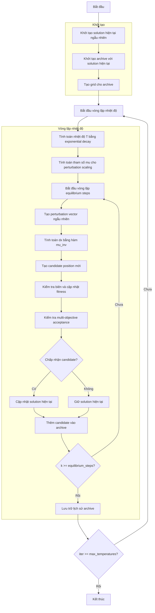

# Sơ đồ thuật toán Multi Objective Simulated Annealing Optimizer



### Giải thích chi tiết các bước:

1. **Khởi tạo solution hiện tại ngẫu nhiên**: 
   - Tạo vị trí ngẫu nhiên trong không gian tìm kiếm
   - Tính toán giá trị hàm mục tiêu
   ```python
   current_position = np.random.uniform(self.lb, self.ub, self.dim)
   current_fitness = self.objective_func(current_position)
   ```

2. **Khởi tạo archive với solution hiện tại**:
   - Thêm solution hiện tại vào archive
   - Archive sẽ được cập nhật với các giải pháp không bị chi phối

3. **Tạo grid cho archive**:
   - Tạo lưới hypercubes để quản lý archive
   - Gán chỉ số grid cho từng giải pháp trong archive

4. **Vòng lặp nhiệt độ** (max_temperatures lần):
   - **Tính toán nhiệt độ T bằng exponential decay**: Nhiệt độ giảm dần theo iteration
     ```python
     T = exponential_decay(initial_temperature, final_value, iter, max_iter)
     ```
   
   - **Tính toán tham số mu cho perturbation scaling**: Tham số scaling dựa trên nhiệt độ
     ```python
     mu = 10 ** (T * self.mu_scaling)
     ```
   
   - **Vòng lặp equilibrium steps** (equilibrium_steps lần):
     * **Tạo perturbation vector ngẫu nhiên**: Vector ngẫu nhiên trong khoảng [-1, 1]
       ```python
       random_vector = 2 * np.random.random(self.dim) - 1
       ```
     * **Tính toán dx bằng hàm mu_inv**: Tính toán độ dịch chuyển dựa trên mu
       ```python
       dx = self._mu_inv(random_vector, mu) * (self.ub - self.lb)
       ```
     * **Tạo candidate position mới**: Tạo vị trí candidate từ vị trí hiện tại + dx
       ```python
       candidate_position = current_solution.position + dx
       ```
     * **Kiểm tra biên và cập nhật fitness**: Đảm bảo vị trí trong biên và tính fitness
     * **Kiểm tra multi-objective acceptance**: Quyết định chấp nhận candidate dựa trên dominance và nhiệt độ
       - Nếu candidate dominates current: Luôn chấp nhận
       - Nếu current dominates candidate: Luôn từ chối  
       - Nếu không dominated: Chấp nhận với xác suất dựa trên nhiệt độ
       ```python
       accept_prob = np.exp(df / (temperature + np.finfo(float).eps))
       ```
     * **Cập nhật solution hiện tại**: Nếu candidate được chấp nhận
     * **Thêm candidate vào archive**: Thêm candidate vào archive để xem xét
   
   - **Lưu trữ lịch sử archive**: Lưu trạng thái archive sau mỗi temperature level

5. **Kết thúc**:
   - Lưu trữ kết quả cuối cùng
   - Trả về lịch sử archive và archive cuối cùng

### Chi tiết Multi-Objective Acceptance:

**Quyết định chấp nhận**:
1. **Candidate dominates current**: Luôn chấp nhận
2. **Current dominates candidate**: Luôn từ chối
3. **Không dominated nhau**: Chấp nhận với xác suất
   ```python
   current_avg = np.mean(current.multi_fitness)
   candidate_avg = np.mean(candidate.multi_fitness)
   
   if self.maximize:
       df = candidate_avg - current_avg
   else:
       df = current_avg - candidate_avg
   
   accept_prob = np.exp(df / (temperature + np.finfo(float).eps))
   ```

### Tham số Simulated Annealing:

**Tham số chính**:
- `max_temperatures` (100): Số lượng temperature levels tối đa
- `equilibrium_steps` (500): Số steps tại mỗi temperature level
- `initial_temperature` (1): Nhiệt độ ban đầu
- `tol_fun` (1e-4): Function tolerance for convergence
- `mu_scaling` (100.0): Tham số scaling cho perturbation

**Hàm perturbation**:
- `_mu_inv()`: Hàm tạo perturbation dựa trên nhiệt độ
- `exponential_decay()`: Hàm giảm nhiệt độ theo cấp số nhân

**Đặc điểm của SA đa mục tiêu**:
- Sử dụng Pareto dominance thay vì so sánh fitness scalar
- Xác suất chấp nhận dựa trên nhiệt độ và độ chênh lệch fitness trung bình
- Archive được duy trì để lưu trữ các giải pháp không bị chi phối
- Perturbation scale giảm dần theo nhiệt độ (từ khám phá sang khai thác)
