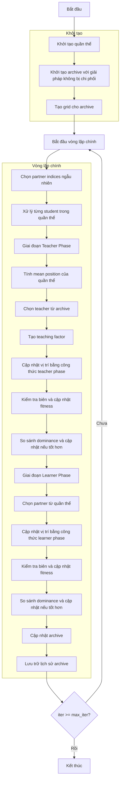

# Sơ đồ thuật toán Multi Objective Teaching Learning Based Optimizer



### Giải thích chi tiết các bước:

1. **Khởi tạo quần thể**: 
   - Tạo ngẫu nhiên các vị trí ban đầu trong không gian tìm kiếm
   - Mỗi vị trí X_i ∈ [lb, ub]^dim
   - Tính toán giá trị hàm mục tiêu multi_fitness = objective_func(X_i)

2. **Khởi tạo archive với giải pháp không bị chi phối**:
   - Xác định các giải pháp không bị chi phối trong quần thể ban đầu
   - Thêm các giải pháp này vào archive bên ngoài

3. **Tạo grid cho archive**:
   - Tạo lưới hypercubes để quản lý archive
   - Gán chỉ số grid cho từng giải pháp trong archive

4. **Vòng lặp chính** (max_iter lần):
   - **Chọn partner indices ngẫu nhiên**: Xáo trộn ngẫu nhiên chỉ số để chọn partner
     ```python
     partner_indices = np.random.permutation(search_agents_no)
     ```
   
   - **Xử lý từng student trong quần thể**: Duyệt qua từng student để tối ưu hóa
   
   - **Giai đoạn Teacher Phase**:
     * **Tính mean position của quần thể**: Tính toán vị trí trung bình của toàn bộ quần thể
       ```python
       mean_position = np.mean([member.position for member in population], axis=0)
       ```
     * **Chọn teacher từ archive**: Chọn teacher từ archive sử dụng grid-based selection
     * **Tạo teaching factor**: Tạo hệ số giảng dạy ngẫu nhiên trong khoảng (1, 2)
       ```python
       tf = np.random.randint(1, 3)  # 1 hoặc 2
       ```
     * **Cập nhật vị trí bằng công thức teacher phase**:
       ```python
       new_position = current_position + r * (teacher_position - tf * mean_position)
       ```
     * **Kiểm tra biên và cập nhật fitness**: Đảm bảo vị trí trong biên và tính fitness mới
     * **So sánh dominance và cập nhật nếu tốt hơn**: Sử dụng Pareto dominance để quyết định cập nhật
   
   - **Giai đoạn Learner Phase**:
     * **Chọn partner từ quần thể**: Chọn partner ngẫu nhiên từ quần thể
     * **Cập nhật vị trí bằng công thức learner phase**:
       ```python
       if current dominates partner:
           new_position = current_position + r * (current_position - partner_position)
       else:
           new_position = current_position + r * (partner_position - current_position)
       ```
     * **Kiểm tra biên và cập nhật fitness**: Đảm bảo vị trí trong biên và tính fitness mới
     * **So sánh dominance và cập nhật nếu tốt hơn**: Sử dụng Pareto dominance để quyết định cập nhật
   
   - **Cập nhật archive**: Thêm các giải pháp không bị chi phối mới vào archive
   
   - **Lưu trữ lịch sử archive**: Lưu trạng thái archive hiện tại

5. **Kết thúc**:
   - Lưu trữ kết quả cuối cùng
   - Trả về lịch sử archive và archive cuối cùng

### Công thức TLBO:

**Teacher Phase**:
```python
r = np.random.random(self.dim)
new_position = current_position + r * (teacher_position - teaching_factor * mean_position)
```

**Learner Phase**:
```python
r = np.random.random(self.dim)
if current dominates partner:
    new_position = current_position + r * (current_position - partner_position)
else:
    new_position = current_position + r * (partner_position - current_position)
```

**Tham số TLBO**:
- `teaching_factor_range`: Khoảng giá trị cho teaching factor (mặc định: (1, 2))
- Teaching factor (TF) thường là 1 hoặc 2, đại diện cho mức độ ảnh hưởng của giáo viên

**Ưu điểm của TLBO đa mục tiêu**:
- Không cần tham số điều chỉnh phức tạp
- Sử dụng archive và grid-based selection để duy trì đa dạng
- Kết hợp cả học từ giáo viên và học từ bạn học
- Tự động điều chỉnh dựa trên dominance thay vì so sánh fitness scalar
