# Sơ đồ thuật toán Shuffled Frog Leaping Optimizer

```mermaid
flowchart TD
    A["Bắt đầu"] --> B["Khởi tạo tham số SFLA"]
    B --> C["Điều chỉnh kích thước quần thể cho memeplex"]
    C --> D["Khởi tạo quần thể ếch"]
    D --> E["Sắp xếp quần thể và khởi tạo giải pháp tốt nhất"]
    E --> F["Tạo chỉ số memeplex"]
    F --> G["Bắt đầu vòng lặp chính"]
    G --> H["Chuẩn bị tham số FLA"]
    H --> I["Xáo trộn quần thể"]
    I --> J["Xử lý từng memeplex"]
    J --> K["Trích xuất memeplex"]
    K --> L["Chạy Frog Leaping Algorithm trên memeplex"]
    L --> M["Tính toán xác suất chọn lọc"]
    M --> N["Chọn cha mẹ"]
    N --> O["Tạo con cái"]
    O --> P["Sắp xếp cha mẹ từ tốt nhất đến tồi nhất"]
    P --> Q["Cải thiện Bước 1: Di chuyển về phía cha mẹ tốt nhất"]
    Q --> R{"Vị trí mới trong biên và tốt hơn?"}
    R -- "Có" --> S["Cập nhật memeplex"]
    R -- "Không" --> T["Cần cải thiện Bước 2"]
    T --> U["Cải thiện Bước 2: Di chuyển về phía giải pháp toàn cục tốt nhất"]
    U --> V{"Vị trí mới trong biên và tốt hơn?"}
    V -- "Có" --> S
    V -- "Không" --> W["Cần kiểm duyệt"]
    W --> X["Kiểm duyệt: Thay thế bằng giải pháp ngẫu nhiên"]
    X --> S
    S --> Y["Cập nhật quần thể"]
    Y --> Z["Sắp xếp quần thể và cập nhật giải pháp tốt nhất"]
    Z --> AA["Lưu trữ giải pháp tốt nhất"]
    AA --> AB{"iter >= max_iter?"}
    AB -- "Chưa" --> G
    AB -- "Rồi" --> AC["Kết thúc"]
    
    subgraph Khởi tạo
    B
    C
    D
    E
    F
    end
    
    subgraph Vòng lặp chính
    H
    I
    J
    K
    L
    M
    N
    O
    P
    Q
    R
    S
    T
    U
    V
    W
    X
    Y
    Z
    AA
    end
```



### Giải thích chi tiết các bước:

1. **Khởi tạo tham số SFLA**:
   - Thiết lập các tham số mặc định cho thuật toán
   - n_memeplex: Số lượng memeplex
   - memeplex_size: Kích thước mỗi memeplex
   - fla_q: Số lượng cha mẹ trong FLA
   - fla_alpha: Số lượng con cái
   - fla_beta: Số lần lặp tối đa trong FLA
   - fla_sigma: Kích thước bước di chuyển

2. **Điều chỉnh kích thước quần thể cho memeplex**:
   ```python
   total_pop_size = self.n_memeplex * self.memeplex_size
   ```

3. **Khởi tạo quần thể ếch**:
   - Tạo ngẫu nhiên các vị trí ban đầu trong không gian tìm kiếm
   - Mỗi vị trí X_i ∈ [lb, ub]^dim
   - Tính toán giá trị hàm mục tiêu objective_func(X_i)

4. **Sắp xếp quần thể và khởi tạo giải pháp tốt nhất**:
   - Sắp xếp quần thể dựa trên giá trị fitness
   - Chọn giải pháp tốt nhất ban đầu

5. **Tạo chỉ số memeplex**:
   ```python
   memeplex_indices = np.arange(search_agents_no).reshape(self.n_memeplex, self.memeplex_size)
   ```

6. **Vòng lặp chính** (max_iter lần):
   - **Xáo trộn quần thể**:
     * Trộn ngẫu nhiên quần thể để tạo memeplex mới

   - **Xử lý từng memeplex**:
     * Mỗi memeplex được xử lý độc lập bằng Frog Leaping Algorithm

   - **Chạy Frog Leaping Algorithm trên memeplex**:
     * **Tính toán xác suất chọn lọc**:
       ```python
       selection_probs = 2 * (n_pop + 1 - ranks) / (n_pop * (n_pop + 1))
       ```
     * **Chọn cha mẹ**:
       * Chọn q cha mẹ dựa trên xác suất chọn lọc

     * **Tạo con cái**:
       * Tạo alpha con cái từ các cha mẹ đã chọn

     * **Cải thiện Bước 1: Di chuyển về phía cha mẹ tốt nhất**:
       ```python
       step = self.fla_sigma * np.random.random(self.dim) * (sorted_parents[0].position - worst_parent.position)
       new_sol_1.position = worst_parent.position + step
       ```

     * **Cải thiện Bước 2: Di chuyển về phía giải pháp toàn cục tốt nhất**:
       ```python
       step = self.fla_sigma * np.random.random(self.dim) * (best_solution.position - worst_parent.position)
       new_sol_2.position = worst_parent.position + step
       ```

     * **Kiểm duyệt: Thay thế bằng giải pháp ngẫu nhiên**:
       * Nếu cả hai bước cải thiện đều thất bại, thay thế bằng giải pháp ngẫu nhiên trong phạm vi memeplex

   - **Cập nhật quần thể**:
     * Cập nhật memeplex với các giải pháp mới

   - **Sắp xếp quần thể và cập nhật giải pháp tốt nhất**:
     * So sánh và cập nhật nếu tìm thấy giải pháp tốt hơn

   - **Lưu trữ giải pháp tốt nhất**:
     * Lưu lại giải pháp tốt nhất tại mỗi iteration

7. **Kết thúc**:
   - Lưu trữ kết quả cuối cùng
   - Hiển thị lịch sử tối ưu hóa
   - Trả về giải pháp tốt nhất và lịch sử
