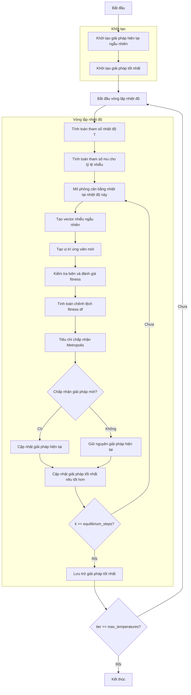

# Sơ đồ thuật toán Simulated Annealing Optimizer



### Giải thích chi tiết các bước:

1. **Khởi tạo giải pháp hiện tại ngẫu nhiên**: 
   - Tạo ngẫu nhiên vị trí ban đầu trong không gian tìm kiếm
   - Vị trí X ∈ [lb, ub]^dim
   - Tính toán giá trị hàm mục tiêu objective_func(X)

2. **Khởi tạo giải pháp tốt nhất**:
   - Khởi tạo giải pháp tốt nhất ban đầu từ giải pháp hiện tại

3. **Vòng lặp nhiệt độ** (max_temperatures lần):
   - **Tính toán tham số nhiệt độ T**:
     ```python
     T = iter / actual_max_iter  # Từ 0 đến 1
     ```

   - **Tính toán tham số mu cho tỷ lệ nhiễu**:
     ```python
     mu = 10 ** (T * self.mu_scaling)
     ```

   - **Mô phỏng cân bằng nhiệt tại nhiệt độ này** (equilibrium_steps lần):
     * **Tạo vector nhiễu ngẫu nhiên**:
       ```python
       random_vector = 2 * np.random.random(self.dim) - 1  # [-1, 1]
       dx = self._mu_inv(random_vector, mu) * (self.ub - self.lb)
       ```

     * **Tạo vị trí ứng viên mới**:
       ```python
       candidate_position = current_solution.position + dx
       ```

     * **Kiểm tra biên và đánh giá fitness**:
       * Đảm bảo vị trí nằm trong biên [lb, ub]
       * Tính toán giá trị hàm mục tiêu cho vị trí mới

     * **Tính toán chênh lệch fitness df**:
       ```python
       df = candidate_fitness - current_solution.fitness
       ```

     * **Tiêu chí chấp nhận Metropolis**:
       * **Đối với tối đa hóa**:
         ```python
         accept = (df > 0) or (np.random.random() > 
                 np.exp(T * df / (abs(current_solution.fitness) + np.finfo(float).eps) / self.tol_fun))
         ```
       * **Đối với tối thiểu hóa**:
         ```python
         accept = (df < 0) or (np.random.random() < 
                 np.exp(-T * df / (abs(current_solution.fitness) + np.finfo(float).eps) / self.tol_fun))
         ```

     * **Cập nhật giải pháp hiện tại**:
       * Chấp nhận giải pháp mới nếu đáp ứng tiêu chí Metropolis

     * **Cập nhật giải pháp tốt nhất**:
       * So sánh và cập nhật nếu tìm thấy giải pháp tốt hơn

   - **Lưu trữ giải pháp tốt nhất**:
     * Lưu lại giải pháp tốt nhất tại mỗi mức nhiệt độ

4. **Kết thúc**:
   - Lưu trữ kết quả cuối cùng
   - Hiển thị lịch sử tối ưu hóa
   - Trả về giải pháp tốt nhất và lịch sử

### Hàm mu_inv:
```python
def _mu_inv(self, y: np.ndarray, mu: float) -> np.ndarray:
    """
    Tạo vector nhiễu tỷ lệ với mức nhiệt độ hiện tại.
    
    Công thức:
    mu_inv(y) = (((1 + mu) ** |y| - 1) / mu) * sign(y)
    """
    return (((1 + mu) ** np.abs(y) - 1) / mu) * np.sign(y)
