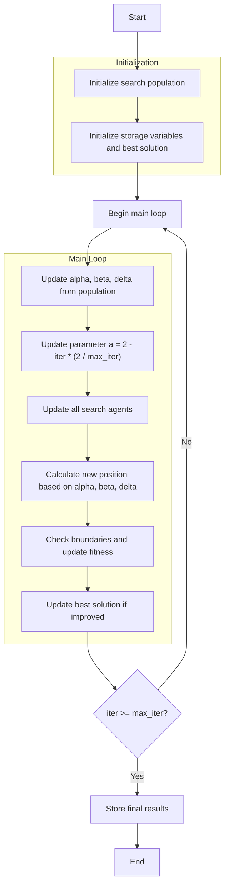

# Guidelines for Drawing Algorithm Flowcharts from Source Code

## Objective:

From the provided Python optimization algorithm source code, analyze, understand, and build an algorithm flowchart described in **English natural language**, combined with a **Mermaid diagram** to illustrate the processing flow. Then save the result as a `.md` file.

## Workflow:

### 1. Analyze and build the algorithm flowchart:

* Read and understand the provided Python source code.
* Extract the processing flow and main components of the algorithm.
* Use `mermaid` to describe the algorithm flowchart in **English**.

### 2. Create a Markdown file to store the flowchart:

* Save the content into a file named `{algorithm_name}-flowchart.md` corresponding to the algorithm being processed.
* Place the file in the directory: `/docs/flowcharts/`

### 3. Feedback and revisions:

* After creating the initial version, ask me if any edits or expansions are needed.
* If I provide feedback, carefully review the entire `.md` file to understand the changes requested.
* Update the content according to the feedback until I confirm it is complete.

## File structure of `{algorithm_name}-flowchart.md`:

The Markdown file should have **3 main sections**:

1. **Algorithm Flowchart Title** (H1 header):

   * Example: `# Grey Wolf Optimizer Flowchart`

2. **Algorithm Flowchart** (Mermaid flowchart in English):

   * Node writing rules:

     * All node content must be inside quotes `""`

       * ✅ Example: `A["Start"]`
       * ❌ Example: `A[Start]`
       * ✅ Example: `A{"Start"}`
       * ❌ Example: `A{Start}`
       * ✅ Example: `-- "No" -->`
       * ❌ Example: `-- No -->`
     * Do not use line breaks (`\n`) inside nodes.

       * Use short one-line descriptions, e.g., `"Initialize population"` instead of `"Initialize\npopulation"`.
     * Variables or simple formulas can be included, e.g.:

       * `"Update parameter a"` or `"X_i = (X_alpha + X_beta + X_delta)/3"`

3. **Detailed step explanation**:

   * Written in English.
   * Clearly describe the steps shown in the flowchart in text form.
   * If formulas are needed, present them inside a Python code block, e.g.:

     ```python
     # Update position:
     new_position[j] = (X1 + X2 + X3) / 3
     ```

## Directory structure:

```
docs/
└── flowcharts/                         # Folder containing algorithm flowcharts
    ├── greywolf_optimizer.md
    ├── particleswarm_optimizer.md
    ├── artificialbeecolony_optimizer.md
    └── ...
```

## Important notes:

* Use **English only** for both flowchart nodes and explanations.
* Do not abbreviate processing steps.
* Ensure the flowchart fully reflects the main algorithm pipeline: initialization → loop → termination.
* Always confirm with me after generating the `.md` file.

## Example (reference):

#### Input:
---
```python
class GreyWolfOptimizer(Solver):
    def solver(self, search_agents_no: int, max_iter: int) -> Tuple[List, Member]:
        # Initialize the population of search agents
        population = self._init_population(search_agents_no)

        # Initialize storage variables
        history_step_solver = []
        best_solver = self.best_solver
        
        # Call the begin function
        self._begin_step_solver(max_iter)

        # Main optimization loop
        for iter in range(max_iter):
            # Update alpha, beta, delta based on current population
            _, idx = self._sort_population(population)
            alpha = population[idx[0]].copy()
            beta = population[idx[1]].copy()
            delta = population[idx[2]].copy()

            # Update a parameter (decreases linearly from 2 to 0)
            a = 2 - iter * (2 / max_iter)
            
            # Update all search agents
            for i, member in enumerate(population):
                new_position = np.zeros(self.dim)
                
                for j in range(self.dim):
                    # Update position using alpha, beta, and delta wolves
                    r1 = np.random.random()
                    r2 = np.random.random()
                    
                    A1 = 2 * a * r1 - a
                    C1 = 2 * r2
                    
                    D_alpha = abs(C1 * alpha.position[j] - member.position[j])
                    X1 = alpha.position[j] - A1 * D_alpha
                    
                    r1 = np.random.random()
                    r2 = np.random.random()
                    
                    A2 = 2 * a * r1 - a
                    C2 = 2 * r2
                    
                    D_beta = abs(C2 * beta.position[j] - member.position[j])
                    X2 = beta.position[j] - A2 * D_beta
                    
                    r1 = np.random.random()
                    r2 = np.random.random()
                    
                    A3 = 2 * a * r1 - a
                    C3 = 2 * r2
                    
                    D_delta = abs(C3 * delta.position[j] - member.position[j])
                    X3 = delta.position[j] - A3 * D_delta
                    
                    # Update position component
                    new_position[j] = (X1 + X2 + X3) / 3
                
                # Ensure positions stay within bounds
                new_position = np.clip(new_position, self.lb, self.ub)
                
                # Update member position and fitness
                population[i].position = new_position
                population[i].fitness = self.objective_func(new_position)
                
                # Update best immediately if better solution found
                if self._is_better(population[i], best_solver):
                    best_solver = population[i].copy()
            
            # Store the best solution at this iteration
            history_step_solver.append(best_solver)
            # Call the callbacks 
            self._callbacks(iter, max_iter, best_solver) 
            
        # Final evaluation of all positions to find the best solution
        self.history_step_solver = history_step_solver
        self.best_solver = best_solver
        
        # Call the end function
        self._end_step_solver()
        return history_step_solver, best_solver
```

#### Output: 
---
# Grey Wolf Optimizer Algorithm Flowchart



### Detailed Step-by-Step Explanation:

1. **Initialize search population**:
   - Randomly generate initial positions within the search space
   - Each position X_i ∈ [lb, ub]^dim
   - Calculate objective function value objective_func(X_i)

2. **Initialize storage variables and best solution**:
   - Initialize optimization history history_step_solver
   - Initialize initial best solution best_solver

3. **Main loop** (max_iter times):
   - **Update alpha, beta, delta**:
     * Sort population and select 3 best solutions
     * Alpha: best solution
     * Beta: second best solution
     * Delta: third best solution

   - **Update parameter a**:
     * Linearly decreases from 2 to 0 based on iteration count
     ```python
     a = 2 - iter * (2 / max_iter)
     ```

   - **Update all search agents**:
     * Each agent updates position based on alpha, beta, delta
     * Calculate random A and C vectors
     ```python
     A = 2 * a * r1 - a
     C = 2 * r2
     D_alpha = abs(C * alpha.position[j] - member.position[j])
     X1 = alpha.position[j] - A * D_alpha
     ```

   - **Calculate new position**:
     * Combine contributions from alpha, beta, delta
     ```python
     new_position[j] = (X1 + X2 + X3) / 3
     ```

   - **Check boundaries and update fitness**:
     * Ensure position stays within boundaries [lb, ub]
     * Recalculate objective function value

   - **Update best solution**:
     * Compare and update if better solution is found

4. **Termination**:
   - Store final results
   - Display optimization history
   - Return best solution and history
