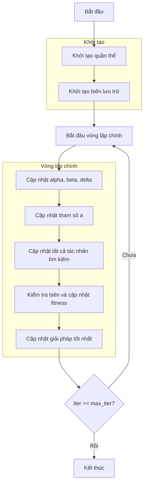

# Quy định hướng dẫn vẽ sơ đồ thuật toán từ mã nguồn

## Mục tiêu:
Từ mã nguồn thuật toán tối ưu hóa Python (do tôi cung cấp), hãy phân tích, hiểu và xây dựng sơ đồ thuật toán bằng ngôn ngữ tự nhiên (tiếng Việt), kết hợp với biểu diễn bằng Mermaid để mô tả luồng xử lý. Sau đó lưu lại dưới dạng file `.md`.

## Quy trình thực hiện:

### 1. Phân tích và xây dựng sơ đồ thuật toán:
- Đọc và hiểu nội dung mã nguồn Python được cung cấp.
- Trích xuất luồng xử lý và các thành phần chính của thuật toán.
- Dùng `mermaid` để mô tả sơ đồ thuật toán với nội dung bằng **tiếng Việt**.

### 2. Tạo tệp Markdown lưu sơ đồ:
- Lưu nội dung vào file có tên `{algorithm_name}-flowchart.md` tương ứng với thuật toán đang xử lý.
- File nằm trong thư mục: `/docs/flowcharts_vi/`

### 3. Nhận phản hồi và chỉnh sửa:
- Sau khi tạo nội dung cơ bản, hỏi tôi có cần chỉnh sửa hay mở rộng gì không.
- Nếu tôi đưa ra phản hồi, hãy đọc lại toàn bộ nội dung file `.md` đã tạo để hiểu rõ ý định chỉnh sửa.
- Cập nhật lại nội dung theo phản hồi cho đến khi tôi xác nhận hoàn tất.

## Cấu trúc nội dung tệp `{algorithm_name}-flowchart.md`:

Tệp Markdown gồm **3 phần chính** như sau:

1. **Tên sơ đồ thuật toán** (dùng tiêu đề H1):
   - Ví dụ: `# Sơ đồ thuật toán Grey Wolf Optimizer`

2. **Sơ đồ thuật toán** (dùng Mermaid flowchart, nội dung bằng tiếng Việt):
   - Quy tắc viết node:
     - Tất cả nội dung node nằm trong dấu `""`
       - Ví dụ đúng: `A["Bắt đầu"]`
       - Ví dụ sai: `A[Bắt đầu]`
       - Ví dụ đúng: `A{"Bắt đầu"}`
       - Ví dụ sai: `A{Bắt đầu}`
       - Ví dụ đúng: `-- "Chưa" -->`
       - Ví dụ sai: `-- Chưa -->`
     - Không sử dụng ký tự xuống dòng (`\n`) bên trong node.
       - Viết ngắn gọn trên 1 dòng, ví dụ: `"Khởi tạo quần thể"` thay vì `"Khởi tạo\nquần thể"`
     - Có thể viết rõ biến hoặc công thức đơn giản, ví dụ:
       - `"Cập nhật tham số a"` hoặc `"X_i = (X_alpha + X_beta + X_delta)/3"`

3. **Giải thích chi tiết các bước**:
   - Viết bằng tiếng Việt.
   - Nêu rõ các bước xử lý trong sơ đồ bằng văn bản.
   - Nếu có công thức, hãy trình bày bằng khối mã Python:
     - Ví dụ:
       ```python
       # Cập nhật vị trí:
       new_position[j] = (X1 + X2 + X3) / 3
       ```

## Cấu trúc thư mục lưu trữ:

```
docs/
└── flowcharts_vi/                         # Thư mục chứa các sơ đồ thuật toán
    ├── greywolf_optimizer.md
    ├── particleswarm_optimizer.md
    ├── artificialbeecolony_optimizer.md
    └── ...
```

## Lưu ý quan trọng:
- Chỉ sử dụng **tiếng Việt** cho nội dung sơ đồ và giải thích.
- Không viết tắt các bước xử lý.
- Đảm bảo sơ đồ phản ánh đầy đủ luồng chính của thuật toán: khởi tạo → vòng lặp → kết thúc.
- Luôn xác nhận lại với tôi sau khi tạo xong file `.md`.

## Ví dụ chuẩn:
Tôi sẽ cung cấp đầu vào là mã Python (xem ví dụ bên dưới) và bạn sẽ phản hồi với file `.md` đã hoàn chỉnh theo quy tắc trên.

#### **Đầu vào**:
```python
class GreyWolfOptimizer(Solver):
    def solver(self, search_agents_no: int, max_iter: int) -> Tuple[List, Member]:
        # Initialize the population of search agents
        population = self._init_population(search_agents_no)

        # Initialize storage variables
        history_step_solver = []
        best_solver = self.best_solver
        
        # Call the begin function
        self._begin_step_solver(max_iter)

        # Main optimization loop
        for iter in range(max_iter):
            # Update alpha, beta, delta based on current population
            _, idx = self._sort_population(population)
            alpha = population[idx[0]].copy()
            beta = population[idx[1]].copy()
            delta = population[idx[2]].copy()

            # Update a parameter (decreases linearly from 2 to 0)
            a = 2 - iter * (2 / max_iter)
            
            # Update all search agents
            for i, member in enumerate(population):
                new_position = np.zeros(self.dim)
                
                for j in range(self.dim):
                    # Update position using alpha, beta, and delta wolves
                    r1 = np.random.random()
                    r2 = np.random.random()
                    
                    A1 = 2 * a * r1 - a
                    C1 = 2 * r2
                    
                    D_alpha = abs(C1 * alpha.position[j] - member.position[j])
                    X1 = alpha.position[j] - A1 * D_alpha
                    
                    r1 = np.random.random()
                    r2 = np.random.random()
                    
                    A2 = 2 * a * r1 - a
                    C2 = 2 * r2
                    
                    D_beta = abs(C2 * beta.position[j] - member.position[j])
                    X2 = beta.position[j] - A2 * D_beta
                    
                    r1 = np.random.random()
                    r2 = np.random.random()
                    
                    A3 = 2 * a * r1 - a
                    C3 = 2 * r2
                    
                    D_delta = abs(C3 * delta.position[j] - member.position[j])
                    X3 = delta.position[j] - A3 * D_delta
                    
                    # Update position component
                    new_position[j] = (X1 + X2 + X3) / 3
                
                # Ensure positions stay within bounds
                new_position = np.clip(new_position, self.lb, self.ub)
                
                # Update member position and fitness
                population[i].position = new_position
                population[i].fitness = self.objective_func(new_position)
                
                # Update best immediately if better solution found
                if self._is_better(population[i], best_solver):
                    best_solver = population[i].copy()
            
            # Store the best solution at this iteration
            history_step_solver.append(best_solver)
            # Call the callbacks 
            self._callbacks(iter, max_iter, best_solver) 
            
        # Final evaluation of all positions to find the best solution
        self.history_step_solver = history_step_solver
        self.best_solver = best_solver
        
        # Call the end function
        self._end_step_solver()
        return history_step_solver, best_solver
```

#### **Đầu ra**:
---


### Giải thích chi tiết các bước:
1. **Khởi tạo quần thể**: 
   - Tạo ngẫu nhiên các vị trí ban đầu trong không gian tìm kiếm
   - Mỗi vị trí X_i ∈ [lb, ub]^dim
   - Tính toán giá trị hàm mục tiêu objective_func(X_i)

2. **Khởi tạo biến lưu trữ**:
   - Khởi tạo lịch sử tối ưu hóa
   - Khởi tạo giải pháp tốt nhất ban đầu

3. **Vòng lặp chính** (max_iter lần):
   - **Cập nhật alpha, beta, delta**: 
     * Sắp xếp quần thể và chọn 3 giải pháp tốt nhất
     * Alpha: giải pháp tốt nhất
     * Beta: giải pháp thứ hai
     * Delta: giải pháp thứ ba
   
   - **Cập nhật tham số a**:
     * Giảm tuyến tính từ 2 về 0 theo số lần lặp
     ```python
     a = 2 - iter * (2 / max_iter)
     ```
   
   - **Cập nhật tất cả tác nhân tìm kiếm**:
     * Mỗi tác nhân cập nhật vị trí dựa trên alpha, beta, delta
     ```python
     new_position[j] = (X1 + X2 + X3) / 3
     ```
   
   - **Kiểm tra biên và cập nhật fitness**:
     * Đảm bảo vị trí nằm trong biên [lb, ub]
     * Tính toán lại giá trị hàm mục tiêu
   
   - **Cập nhật giải pháp tốt nhất**:
     * So sánh và cập nhật nếu tìm thấy giải pháp tốt hơn

4. **Kết thúc**:
   - Lưu trữ kết quả cuối cùng
   - Hiển thị lịch sử tối ưu hóa
   - Trả về giải pháp tốt nhất và lịch sử
